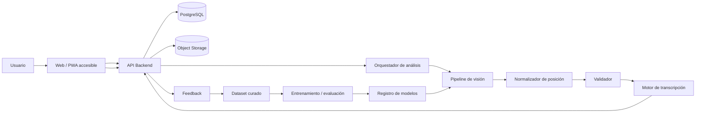

# Chess Accessibility — Arquitectura y hoja de ruta

Aplicación de accesibilidad capaz de analizar imágenes de tableros de ajedrez y convertir su contenido en una transcripción estructurada, accesible para personas ciegas y revisable por personas videntes.

## Objetivo del sistema

El sistema recibe una imagen de un tablero y produce una representación estructurada de la posición:

```text
Imagen del tablero
      ↓
Selección de modo
      ↓
Pipeline de visión artificial
      ↓
Posición estructurada (JSON interno)
      ↓
Validación / normalización
      ↓
Motor de transcripción
      ↓
┌───────────────────┬────────────────────┐
│ Modo accesible    │ Modo vidente       │
│ lectura directa   │ revisión/corrección│
└───────────────────┴────────────────────┘
      ↓
Guardado + feedback controlado
```

## Alcance del MVP

El MVP se centra en reconocer una posición estática y transcribirla correctamente.

Incluye:

- Carga de una imagen.
- Detección del tablero.
- Corrección de perspectiva.
- División 8×8.
- Identificación de casillas ocupadas.
- Reconocimiento de tipo y color de pieza.
- Conversión a coordenadas `a1`–`h8`.
- Generación de transcripción accesible.
- Modo para personas ciegas.
- Modo para personas videntes con revisión y corrección.
- Persistencia de imagen, resultado y correcciones.
- Historial básico.
- Métricas de precisión y trazabilidad.

Fuera del MVP, pero contemplado en la arquitectura:

- Detección de casillas resaltadas.
- Detección de flechas y dirección.
- Mejora específica por estilos de piezas/tableros.
- Aprendizaje a partir de feedback humano mediante pipeline controlado.
- Soporte para vídeo/captura continua.
- Integración con formatos de partidas como FEN/PGN.

## Principios de diseño

1. **Accesibilidad desde el diseño**: el modo para personas ciegas no es una adaptación posterior.
2. **Separación entre visión y transcripción**: el modelo produce una representación estructurada; otro módulo la transforma al formato de salida.
3. **Feedback humano trazable**: una corrección nunca modifica directamente el modelo en producción.
4. **Validación basada en reglas de ajedrez**: las reglas se usan para detectar inconsistencias y pedir revisión, no para inventar piezas.
5. **Modelo intercambiable**: el pipeline de visión no debe quedar acoplado a un único proveedor/modelo.
6. **Privacidad**: las imágenes y correcciones se almacenan con una política explícita de retención y acceso.
7. **Observabilidad**: toda transcripción debe poder relacionarse con la imagen, versión del modelo y resultado final.

## Arquitectura de alto nivel



Consulta el detalle en [ARCHITECTURE.md](./ARCHITECTURE.md).

## Stack propuesto

### Frontend

- TypeScript.
- React.
- PWA para facilitar uso desde móvil/ordenador.
- HTML semántico.
- ARIA solo cuando el HTML semántico no sea suficiente.
- Navegación completa por teclado.
- Compatibilidad con lectores de pantalla.

### Backend

- Python.
- FastAPI.
- Pydantic para contratos de datos.
- PostgreSQL para metadatos, resultados, feedback y auditoría.
- Object Storage compatible con S3 para imágenes.
- Redis + worker asíncrono en caso de que el procesamiento deje de ser interactivo.

### Visión e IA

- OpenCV para preprocesado, detección geométrica y rectificación.
- Modelo de detección/clasificación de piezas entrenado específicamente con tableros de distintos estilos.
- Capa opcional de modelo multimodal/VLM como segundo nivel de verificación, nunca como única fuente de verdad en el MVP.
- Motor determinista para coordenadas, normalización y formato de salida.

### DevOps

- Docker.
- CI para tests, linting y validaciones.
- Entornos separados para desarrollo, staging y producción.
- Registro de versiones de modelos y datasets.

## Estructura de repositorio recomendada

```text
.
├── README.md
├── ARCHITECTURE.md
├── ROADMAP.md
├── apps/
│   ├── web/
│   └── api/
├── services/
│   ├── vision/
│   ├── transcription/
│   ├── validation/
│   └── feedback/
├── packages/
│   └── contracts/
├── models/
├── data/
│   ├── raw/
│   ├── annotations/
│   └── curated/
├── tests/
├── infra/
└── docs/
```

## Flujo de una petición

1. El usuario sube una imagen.
2. La API crea una ejecución y un identificador de trazabilidad.
3. Se valida el formato, tamaño y calidad mínima.
4. Se detecta y rectifica el tablero.
5. Se analizan las 64 casillas.
6. Se crea una `BoardState` estructurada.
7. Se valida coherencia geométrica y, cuando proceda, coherencia ajedrecística.
8. Se genera una transcripción estable.
9. El resultado se muestra según el modo de acceso.
10. El resultado y la entrada quedan asociados en el historial.
11. En modo vidente, una corrección genera un evento de feedback.
12. El feedback pasa al dataset curado antes de cualquier reentrenamiento.

## Contrato de posición interna

El sistema debería usar una estructura intermedia como esta:

```json
{
  "board_orientation": "white-at-bottom",
  "pieces": [
    {"color": "white", "type": "king", "square": "e1", "confidence": 0.99},
    {"color": "black", "type": "king", "square": "e8", "confidence": 0.98}
  ],
  "highlights": [],
  "arrows": [],
  "model_version": "vision-model@...",
  "pipeline_version": "..."
}
```

El contrato exacto deberá versionarse para evitar incompatibilidades entre frontend, backend y modelos.

## Accesibilidad del resultado

La salida debe permitir lectura lineal y navegación predecible. La interfaz no debe depender de color, posición visual o arrastre.

Ejemplo de transcripción:

```text
Re⠂
Dc⠒
Pg⠢
...
```

La tabla de equivalencias Braille de filas y la sintaxis completa deben quedar en un único módulo de dominio para evitar inconsistencias.

## Feedback y aprendizaje

El feedback se almacena como una observación independiente:

```text
predicción original
      +
corrección humana
      +
usuario / contexto / fecha
      +
versión del modelo
      ↓
registro de feedback
      ↓
revisión / curación
      ↓
dataset de entrenamiento
      ↓
experimento
      ↓
evaluación offline
      ↓
modelo candidato
      ↓
despliegue controlado
```

No se recomienda realizar aprendizaje online directo con cada corrección.

## Puesta en marcha local — propuesta

La primera implementación puede ejecutarse con Docker Compose:

```bash
git clone <repositorio>
cd <repositorio>
cp .env.example .env
docker compose up --build
```

Servicios esperados:

- `web`: interfaz accesible.
- `api`: API REST.
- `worker`: procesamiento de imágenes.
- `postgres`: persistencia.
- `redis`: cola/cache opcional.
- `object-storage`: almacenamiento de imágenes en desarrollo.

## Calidad y pruebas

El proyecto debe mantener tres niveles de pruebas:

- **Unitarias**: coordenadas, Braille, transcripción, validadores y contratos.
- **Integración**: API + almacenamiento + pipeline.
- **Evaluación de IA**: dataset separado de entrenamiento, validación y prueba.

Las métricas del modelo no deben confundirse con las métricas de producto. La aplicación puede medir, por separado, exactitud de pieza, exactitud de casilla, exactitud de posición completa, tasa de corrección humana y tiempo de procesamiento.

## Licencia y datos

La licencia del software y las condiciones de uso de imágenes/datos deben decidirse antes de publicar datasets o modelos entrenados. Los datos aportados por usuarios deben gestionarse con consentimiento y controles de acceso adecuados.
